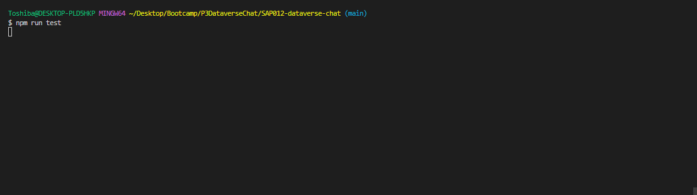

# Dataverse Chat

## Índice

* [1. Resumo do projeto](#1-resumo-do-projeto)
* [2. Ferramentas utilizadas](#2-ferramentas-utilizadas)
* [3. Funcionalidades](#3-funcionalidades)
* [4. Considerações técnicas](#4-considerações-técnicas)
* [5. Tarefas](#5-Tarefas)
* [6. Objetivos de aprendizagem](#6-objetivos-de-aprendizagem)
* [7. Considerações finais](#10-considerações-finais)

***

## 1. Resumo do projeto

No nosso dia a dia, as aplicações web são como amigas inseparáveis.
Desde as redes sociais até as ferramentas de trabalho, nós as utilizamos
o tempo todo. Mas o que torna este momento realmente especial é que
essas aplicações podem nos abrir uma porta para algo incrível:
a interação com a inteligência artificial.

E se pudéssemos conversar com alguém que viveu há mais de cem anos ou
até mesmo com os personagens de nossas séries e filmes favoritos, ou com entidades
que normalmente não podem falar, como por exemplo planetas ou animais?
A inteligência artificial pode nos ajudar a entender o passado e nos conectar
com figuras históricas, assim como nos imergir em mundos fictícios.

Neste projeto, foi desenvolvida uma SPA (Single Page Application) responsiva, com sistema de roteamento e componentização. A temática escolhida é mulheres na tecnologia, onde são exibidos 24 cards, cada um deles traz informações de uma personagem: uma mulher profisional de uma carreira tech. A página tem as seguintes funcionalidades: visualização dos cards, filtragem por formação das profissionais, cálculo da estatística de quantas profissões são relacionadas a cada formação e ordenação por média salarial. Além disso, é possível interagir com cada uma das personagens, iniciando um chat, com objetivo de obter mais informações sobre sua respectiva carreira. Cada personagem está configurada com uma personalidade e tom de voz. A aplicação consome recursos da API da OpenAI, para o funcionamento do chat.

- Este projeto foi realizado em dupla por Camila Lara e Fabine Specian, com apoio da equipe e das colegas do Bootcamp de Desenvolvimento Front-end da **Laboratória**.
- O principal objetivo desse projeto é a aprendizagem e o desenvolvimento de habilidades técnicas e softskills.
- Não foi permitido o uso de frameworks de CSS (Bootstrap, Materialize, etc).
- O tempo de conclusão do projeto foi de 5 Sprints.
- O projeto foi publicado no [Netlify](https://dataversechat-mulherestech.netlify.app/
).

 
## 2. Ferramentas utilizadas

### Preparo do PC para trabalhar

+ Node.js
+ Git e GitBash
+ Playwright
+ Visual Studio Code

### Organização e planejamento

+ GitHub

+ Trello: [Dataverse-Chat](https://trello.com/b/i1p8ocwU/dataverse-chat)

+ Notion: [Dataverse-Chat](https://smooth-henley-73f.notion.site/DATAVERSE-CHAT-9d7915e8094944b983d5452b22d036be)

### Linguagens

+ HTML

+ CSS

+ Vanilla JavaScript

## Consumo de API

+ OpenAI

## Prototipagem

+ Figma

## 3. Funcionalidades

Aqui estão definidas de forma mais detalhada as funcionalidades
da aplicação:

* A aplicação é _responsiva_
* A aplicação é uma SPA com várias visualizações:
  - Foi implementado um sistema de roteamento que permite a navegação dentro
    da aplicação.
  - Cada visualização da aplicação é carregada dinamicamente por meio
    do JavaScript.
  - a URL é atualizada de acordo com a visualização carregada,
    assim como o `title` do documento (a aba do navegador).
  - A aplicação é capaz de carregar a visualização correspondente
    à URL atual ao iniciar a aplicação.
* A aplicação contém aa seguintes funcionalidades: visualizar,
  filtrar, ordenar e calcular estatísticas dos dados.
* Ao clicar em um card de personagem, a aplicação redireciona
  para uma visualização **com sua própria URL** que mostra informações
  detalhadas sobre aquele personagem em particular.
* A aplicação permite ao usuário configurar a API Key para
  interagir com a API da Open AI.
* Utilizando a API da Open AI, a aplicação permite que o usuário interaja
  com um personagem através de um chat.
- Indica visualmente quando um personagem estiver
  gerando uma resposta à mensagem enviada.
* A aplicação informa à usuária sobre os erros de rota que possam surgir e/ ou erros 
  interagir com a API.

_Nota_: Para que as conversas funcionem, é essencial que a aplicação seja integrada à IA por meio da API da OpenAI. Para isso, é necessário ter uma API keypara inserir na aplicação.

## 4. Considerações técnicas

A lógica do projeto deve ser implementada completamente em JavaScript (ES6),
HTML e CSS. Neste projeto, NÃO é permitido usar bibliotecas ou frameworks,
apenas **JavaScript puro**.

## 5. Tarefas

### Definição do produto

### Histórias de usuária

### Design da Interface de Usuária

#### Protótipo de alta fidelidade

### Implementação da Interface de Usuária (HTML/CSS/JS)

### Testes unitários

## 6. Objetivos de aprendizagem

### HTML

- **Uso de HTML semântico**

### CSS

- **Uso de seletores de CSS**

- **Modelo de caixa (box model)**

- **Uso de flexbox em CSS**

- **Uso de CSS Grid Layout**

### Web APIs

- **Routing (History API, evento hashchange, window.location)**

- **Browser storage (localStorage, sessionStorage)**

- **Fetch API**

#### DOM (Document Object Model)

- **Uso de seletores de DOM**

- **Manipulação de eventos de DOM (listeners, propagação, delegação)**

- **Manipulação dinâmica de DOM**

### JavaScript

- **Uso de identificadores descritivos (Nomenclatura e Semântica)**

- **Variáveis (declaração, atribuição, escopo)**

- **Funções (params, args, return)**

- **Uso de condicionais (if-else, switch, operador ternário, lógica booleana)**

- **Diferença entre expressões (expressions) e declarações (statements)**

- **Uso de laços (while, for, for..of)**

#### Assincronicidade

- **Callbacks**

- **Promessas**

#### Tipos de dados

- **Diferenciar entre tipos de dados primitivos e não primitivos**

- **Arrays (arranjos)**

- **Objetos (key, value)**

#### Módulos

- **Módulos de ECMAScript (ES modules)**

#### Testing em Javascript

- **Testes unitários (unit tests)**

### HTTP

- **Cabeçalhos (headers)**

- **Consulta ou solicitação (request) e resposta (response).**

- **Códigos de status de HTTP**

### AI Prompting

- **Priming Chatbots**

- **OpenAI API**

### Controle de Versões (Git e GitHub)

#### Git

- **Git: Instalação e configuração**

- **Git: Controle de versão com git (init, clone, add, commit, status, push, pull, remote)**

- **Git: Integração de mudanças entre ramos (branch, checkout, fetch, merge, reset, rebase, tag)**

#### GitHub

- **GitHub: Criação de contas e repositórios, configuração de chave SSH**

- **GitHub: Implantação com GitHub Pages**

- **GitHub: Colaboração pelo Github (branches | forks | pull requests | code review | tags)**

### Centrado no usuário

- **Desenhar e desenvolver um produto ou serviço colocando as usuárias no centro**

### Design de produto

- **Criar protótipos para obter feedback e iterar**

- **Aplicar os princípios de desenho visual (contraste, alinhamento, hierarquia)**

## 7. Considerações finais

A execução do projeto proporcionou a oportunidade de desenvolver muitas habilidades, técnicas e lifeskills. O conhecimento de linguagens, ferramentes e tecnologias, como também organização, planejamento, gestão de tempo, trabalho em equipe, comunicação e autoaprendizagem. Superar os desafios de um projeto trouxe satisfação e autoconfiança.

## Desenvolvedoras

<table>
  <tr>
    <td align="center"><a href="https://github.com/camilasukhada"> <b>Camila Sukhada</b></a> </td>
    <td align="center"><a href="https://github.com/FabineSpecian"> <b>Fabine Specian</b></a> </td>
    
  </tr>
</table>

<table>
 <tr>
  <td> 

  
 
 </td>
  <td> 
 
  
 
  </td>
 </tr> 
</table>

<table>
 <tr>
  <td> 

  </td>

  <td> 

  </td>

  
 </tr> 
</table>

